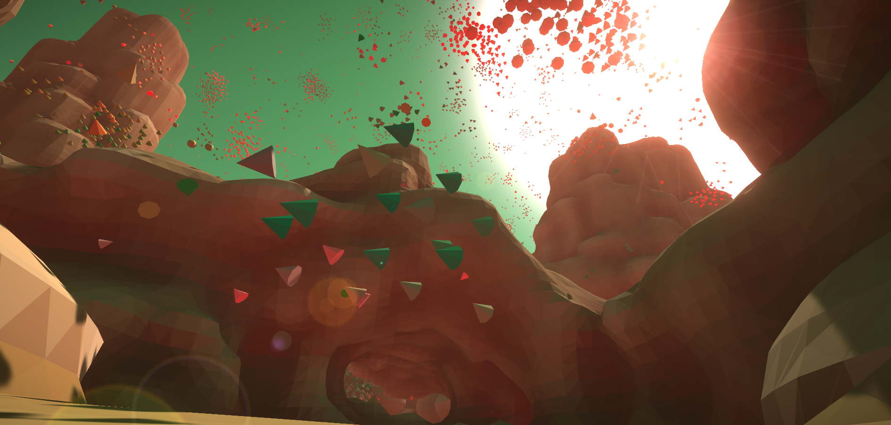

# Fully Procedural 3D World

Dune is a student project developed for the "Hands on 3D Programming" Course of ESIEE Paris.

# PHILOSOPHY OF THE PROJECT:
Project DUNE is a playable workbench used to learn, test and stress some sophisticated computer graphics algorithms such as Marching Cubes or artificial life programs like Boids.
The objective was meshing up all of this amazing techniques inside a single experience.

# CONTROLS:
To move the spaceship use the letters W (forward) A (left) S (backward) D (right);
Use the mouse to rotate the camera;

# CONTROLS:
Q - Move down the spaceship;
E - Move up the spaceship;
R - Reset to the initial position;
M - Go back to the main menu;
Left Shift - (Press and hold) Boost speed;

# REMARKS:
Some already known limitations of this project are represented by the number of Boids on screen. In the final build there are 2^11 boids on screen, using more than this
will likely slow down the performance of the application, this is due to the heavy number of computation the machine has to perform (distances, shader, colliders). A possible 
future improvement could be the tweak of the function which computes the distances between each boid and the ambient.

Another already known bug concers the collision between the player and the environment. In the final build I have used a sphere collider and exploited the physics that Unity offers,
obviously a better collider will already be a major improvement, but also a physics written ad hoc for this application would be even better. It can happens that the rigidbody of the 
spaceship could sometimes cause some bugs with the controls. Another possible improve could be a more sophisticated player controller.

# EXTERNAL ASSETS:
Spaceship - https://www.turbosquid.com/3d-models/3d-drone-dron-model-1688993 - FREE
Script to generate the 3D Perlin noise - https://github.com/keijiro/NoiseShader - FREE
Script to perform a GPU based merge sort - https://github.com/nobnak/GPUMergeSortForUnity - FREE
Cinemachine - https://unity.com/unity/features/editor/art-and-design/cinemachine - FREE
Other small pieces of code were provided from forums or articles, in this cases a comment with the link of the resource is written in the code.

# CREDITS
Written and developed by Gianmarco Tedeschi and Leone Ruggiero 
